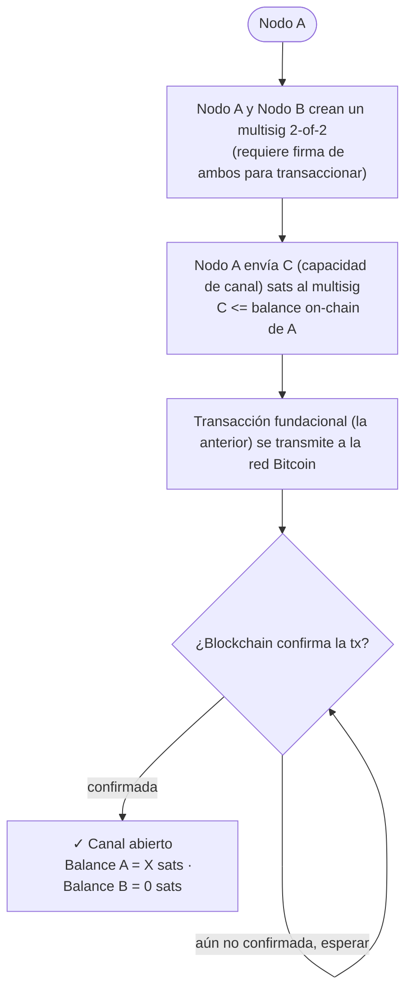
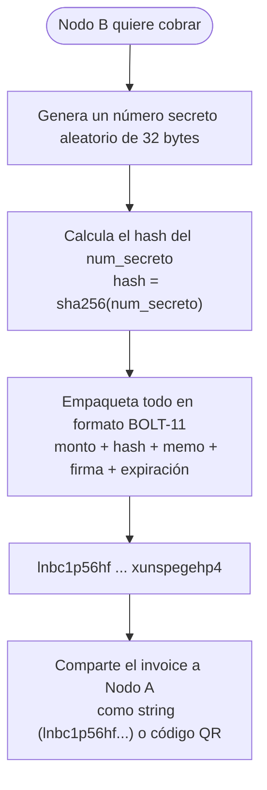
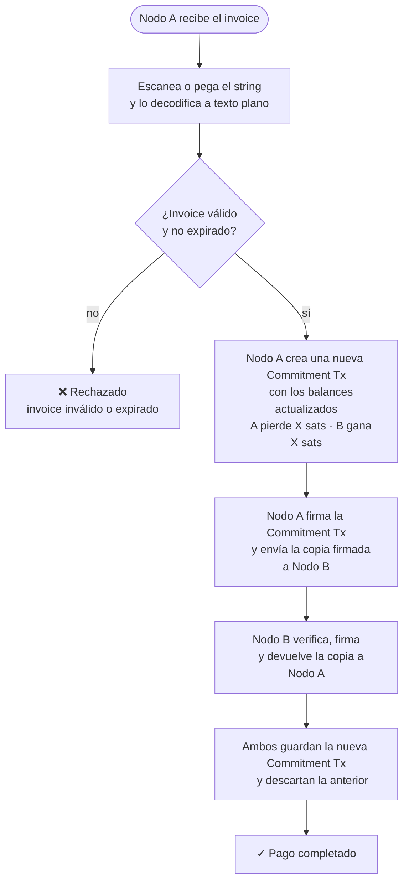
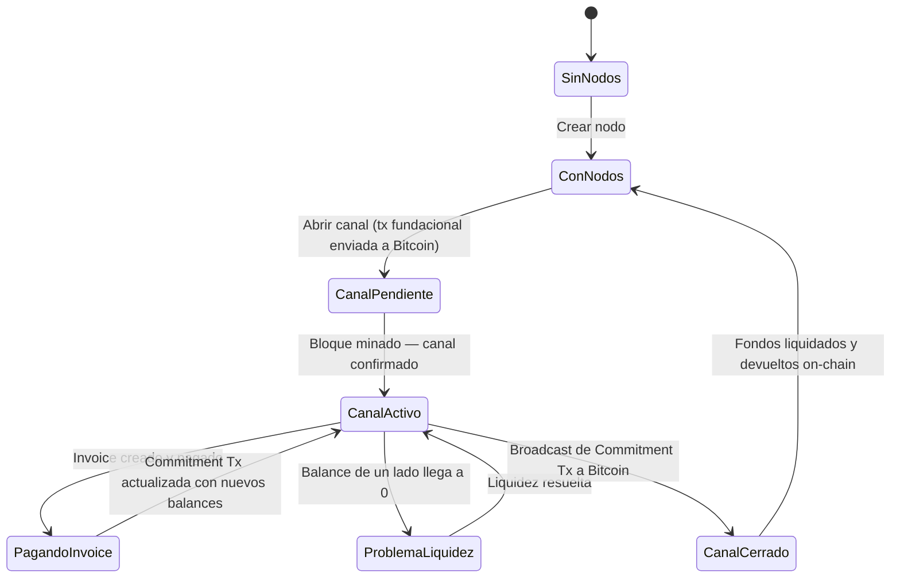
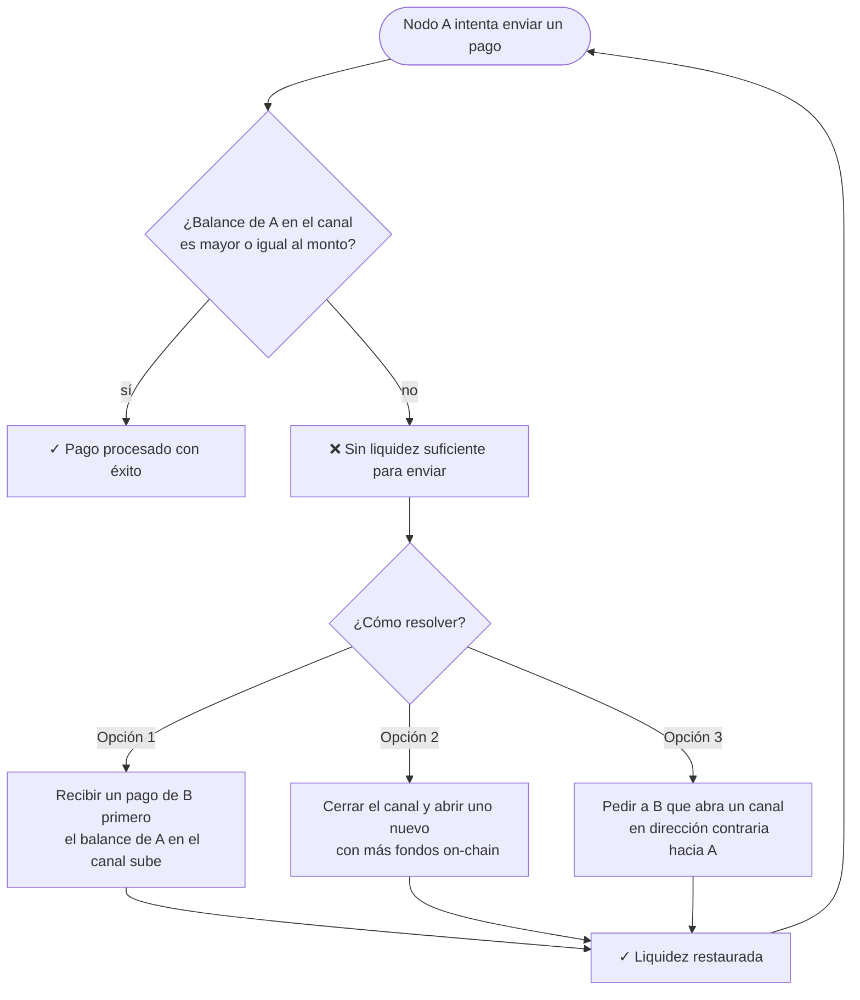

# ⚡ Lightning Network — Diagramas de Flujo

---

## Crear Canal

---

## Hacer Pagos en Lightning

### Crear Invoice

---

### Pagar Invoice

---

## Estado Global del Simulador

---

## Problema de Liquidez

